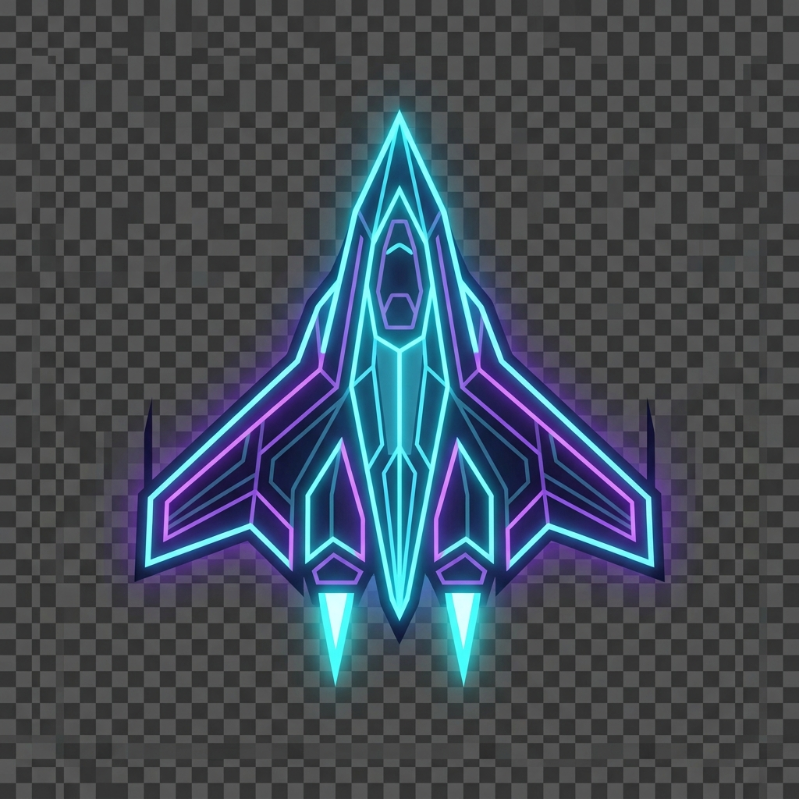

# 🌌 Shatter Space

<div align="center">
  
  <br/>
  <strong>A high-octane 2D space shooter with AAA glassmorphism UI, roguelite upgrades, and intense boss fights, powered by WebGL and Three.js.</strong>
</div>

<br/>

## 🚀 Features
- **Fluid WebGL Compositing**: Blends a buttery-smooth 2D Canvas engine with a dynamic, glowing 3D Three.js nebula background.
- **Roguelite Upgrades**: Buy permanent upgrades (Armor, Lasers, Phase Shift, Gravity Wells, EMPs) in the Hangar between runs.
- **Daily Missions & Prestige**: Earn bonus credits by completing dynamic challenges, or prestige your ship to gain permanent multipliers.
- **Cinematic "Juice"**: Heavy emphasis on game feel, featuring screen-shake, time-slowing hit-stops, chromatic aberration, film grain, and explosive particle physics.
- **Full Gamepad Support**: Seamlessly switch between Mouse/Keyboard and Xbox/PlayStation controllers at any time, complete with a virtual UI cursor.
- **Dynamic Audio**: High-quality SFX and pumping combat music powered by `Howler.js`.

## 🎮 Controls

### Mouse & Keyboard
* **Move:** Mouse Cursor
* **Shoot:** Automatic / Hold Left Click
* **Abilities:** 
  * `1` - EMP Blast
  * `2` - Gravity Well
  * `3` - Phase Shift
* **Settings:** `Esc`

### Gamepad (Controller)
* **Move:** Left Stick
* **Navigate Menus:** Left Stick (Moves Virtual Cursor) + `A` (Select)
* **Scroll Menus:** Right Stick (Up/Down)
* **Abilities:**
  * `B` - EMP Blast
  * `Y` - Gravity Well
  * `LB` (Left Bumper) - Phase Shift
* **Settings:** `X` or `Start`

## 🛠️ Installation & Setup

1. **Clone the repository:**
   ```bash
   git clone https://github.com/daystar-1nine/ShatterSpace.git
   cd ShatterSpace
   ```

2. **Install dependencies:**
   ```bash
   npm install
   ```

3. **Run the local development server:**
   ```bash
   npx vite
   ```

4. **Play!** Open `http://localhost:5173` (or the port Vite provides) in your browser.

## 💻 Tech Stack
- **Core Engine:** Vanilla JavaScript / HTML5 Canvas 2D
- **Background & Post-Processing:** [Three.js](https://threejs.org/) (WebGL)
- **Audio Engine:** [Howler.js](https://howlerjs.com/)
- **Build Tool:** [Vite](https://vitejs.dev/)
- **UI Styling:** Vanilla CSS with modern Glassmorphism aesthetics

## 📝 License
This project is open-source. Feel free to fork, modify, and build upon it!
